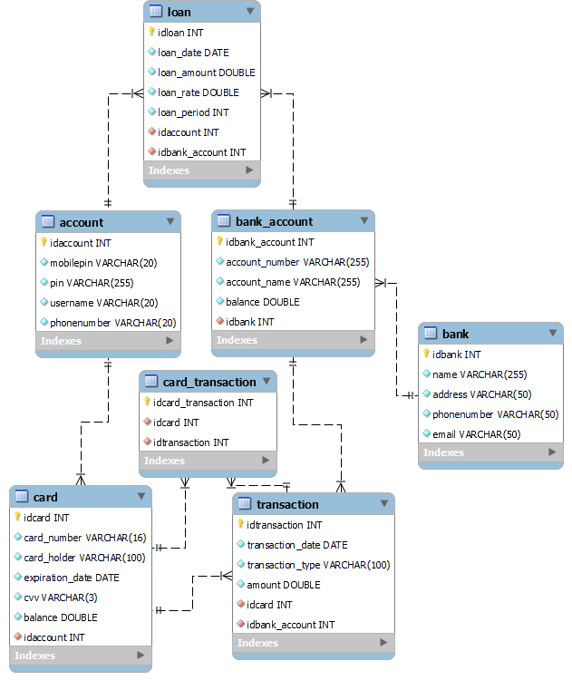

# BANK PROJECT

[Features](#features) - [Project Database](#project-database) - [Developers](#developers) 

## Introduction
Welcome to my innovative banking application project! My goal was to seamlessly integrate various banking functionalities to provide the user with a comprehensive banking experience. Dive into the features below.

---

## Features
Our banking app offers a wide array of features designed to make managing your finances a breeze:

- **Send Money:** Easily transfer funds to friends, family, or businesses with just a few taps.
- **Pay Bills:** Conveniently settle your bills without the hassle of paper checks or queues.
- **Transfer Money:** Move money between your accounts effortlessly.
- **Card Management:** Take control of your cards by adding, deleting, or freezing them as needed.
- **Debit and Credit Options:** Enjoy the flexibility of both debit and credit functionalities tailored to your financial needs.
- **Loans:** Apply for and manage loans directly from the app, whether it's for personal, business, or mortgage purposes.
- **PIN Change:** Securely change your PIN using mobile authentication for added convenience and safety.

### Project database 

*Photo Database diagram*

---

### Developers

| Developers | |
| :---------------: | --- |
| [ ](https://github.com/Ville-A) | Ville Ahola |
 

### Used tools

Feel free to explore my project and contact me for more information!

### Contact

- [LinkedIn](https://www.linkedin.com/in/ville-ahola)
- [GitHub](https://github.com/Ville-A)